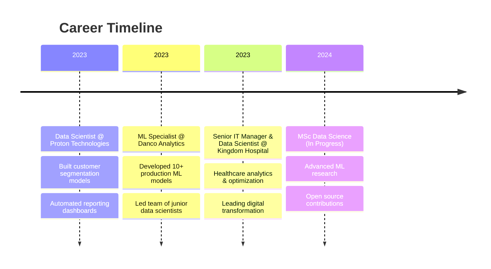

<!-- Animated Header -->
<div align="center">
  
</div>

<!-- Typing Animation -->
<p align="center">
  <a href="https://git.io/typing-svg">
    
  </a>
</p>

<!-- Social Badges -->
<p align="center">
  <a href="https://linkedin.com/in/danielmwanjala"></a>
  <a href="mailto:dmwanjala254@gmail.com"></a>
  <a href="https://madscie254.github.io/MadScie254/"></a>
  <a href="https://github.com/MadScie254"></a>
</p>

<p align="center">
  
  
  
</p>

---

<!-- About Section -->
##  About Me

```python
class DataScientist:
    def __init__(self):
        self.name = "Daniel Mwanjala"
        self.role = "Senior IT Manager & Data Scientist"
        self.location = "Ruiru, Kiambu, Kenya 🇰🇪"
        self.education = "MSc Data Science (In Progress)"
        
    def get_skills(self):
        return {
            "languages": ["Python", "SQL", "R", "JavaScript"],
            "ml_frameworks": ["TensorFlow", "PyTorch", "Scikit-learn", "Keras"],
            "deep_learning": ["CNNs", "RNNs", "LSTMs", "Transformers"],
            "visualization": ["Tableau", "Matplotlib", "Seaborn", "Plotly"],
            "tools": ["Git", "Docker", "AWS", "Jupyter", "VS Code"],
            "databases": ["PostgreSQL", "MongoDB", "MySQL", "Redis"]
        }
    
    def get_current_focus(self):
        return [
            "🔬 Researching Advanced Neural Network Architectures",
            "🌱 Building AI Solutions for Agriculture",
            "📈 Economic Forecasting Models for Kenya",
            "🏥 Healthcare Analytics & Predictive Modeling"
        ]

me = DataScientist()
```


### 🎯 Quick Facts

- 🔭 Currently working at **Kingdom Hospital** as Senior IT Manager & Data Scientist
- 🌱 Pursuing **Master's in Data Science**
- 🏆 **Prime Code Champ Winner** - National Coding Competition
- 💡 Passionate about **AI for Social Good**
- 📊 Built **15+ production ML models**
- 🤝 Open to collaborations on **Data Science & ML projects**
- 📫 Reach me: **dmwanjala254@gmail.com**
- 📱 Phone: **+254 742 007 277**

---

<!-- Tech Stack -->
## 🛠️ Tech Stack & Tools

<details open>
<summary><b>🐍 Languages & Frameworks</b></summary>
<br>
<p align="center">
  
</p>
</details>

<details open>
<summary><b>📊 Data Science & ML</b></summary>
<br>
<p align="center">
  
  
  
  
  
  
  
  
</p>
</details>

<details>
<summary><b>📈 Visualization</b></summary>
<br>
<p align="center">
  
  
  
  
  
</p>
</details>

<details>
<summary><b>🗄️ Databases & Cloud</b></summary>
<br>
<p align="center">
  
  
  
  
  
</p>
</details>

---

<!-- Featured Projects -->
## 🚀 Featured Projects

<div align="center">

| 🎯 Project | 📝 Description | 🛠️ Tech Stack | 📊 Metrics |
|:----------:|:--------------|:-------------:|:----------:|
| **[GDP Prediction Model](https://github.com/MadScie254/gdp-prediction)** | ML model predicting GDP growth using economic indicators | TensorFlow, XGBoost, LSTM | 94% Accuracy |
| **[Plant Disease AI](https://github.com/MadScie254/plant-disease-detection)** | CNN for real-time plant disease identification | TensorFlow, Keras, OpenCV | 96% Detection |
| **[InvestWise Predictor](https://github.com/MadScie254/investwise)** | Regional investment opportunity analyzer | XGBoost, Plotly, Streamlit | 85% ROI Prediction |
| **[Kenya GDP Forecast](https://github.com/MadScie254/kenya-gdp-forecast)** | Time-series forecasting for Kenya's economy | Prophet, ARIMA, Statsmodels | MAPE < 5% |
| **[Netflix Stock Analysis](https://github.com/MadScie254/netflix-stock-analysis)** | Stock analysis with sentiment from social media | LSTM, BERT, NLP | 0.78 Correlation |

</div>

---

<!-- GitHub Stats -->
## 📊 GitHub Analytics

<p align="center">
  <a href="https://github.com/MadScie254">
    
    
  </a>
</p>

<p align="center">
  
</p>

<!-- Activity Graph -->
<p align="center">
  
</p>

<!-- Contribution Snake -->
<picture>
  <source media="(prefers-color-scheme: dark)" srcset="https://raw.githubusercontent.com/MadScie254/MadScie254/output/github-contribution-grid-snake-dark.svg">
  <source media="(prefers-color-scheme: light)" srcset="https://raw.githubusercontent.com/MadScie254/MadScie254/output/github-contribution-grid-snake.svg">
  
</picture>

---

<!-- Certifications -->
## 🏆 Certifications & Awards

<p align="center">
  
  
  
  
  
  
</p>

<p align="center">
  
</p>

---

<!-- Experience Timeline -->
## 💼 Professional Journey



---

<!-- Let's Connect -->
## 🤝 Let's Connect!

<p align="center">
  <i>I'm always interested in collaborating on innovative data science projects, especially those that can make a positive impact on society.</i>
</p>

<p align="center">
  <a href="https://madscie254.github.io/MadScie254/">
    
  </a>
  <a href="https://calendly.com/dmwanjala254">
    
  </a>
  <a href="mailto:dmwanjala254@gmail.com">
    
  </a>
</p>

<p align="center">
  <b>📍 Location:</b> Ruiru, Kiambu, Kenya<br>
  <b>📱 Phone:</b> +254 742 007 277<br>
  <b>✉️ Email:</b> dmwanjala254@gmail.com
</p>

---

<!-- Quote -->
<p align="center">
  
</p>

<!-- Footer -->
<div align="center">
  
</div>

<p align="center">
  <i>⭐️ From <a href="https://github.com/MadScie254">MadScie254</a> with 💜</i>
</p>
import reactDom from 'eslint-plugin-react-dom'

export default defineConfig([
  globalIgnores(['dist']),
  {
    files: ['**/*.{ts,tsx}'],
    extends: [
      // Other configs...
      // Enable lint rules for React
      reactX.configs['recommended-typescript'],
      // Enable lint rules for React DOM
      reactDom.configs.recommended,
    ],
    languageOptions: {
      parserOptions: {
        project: ['./tsconfig.node.json', './tsconfig.app.json'],
        tsconfigRootDir: import.meta.dirname,
      },
      // other options...
    },
  },
])
```
